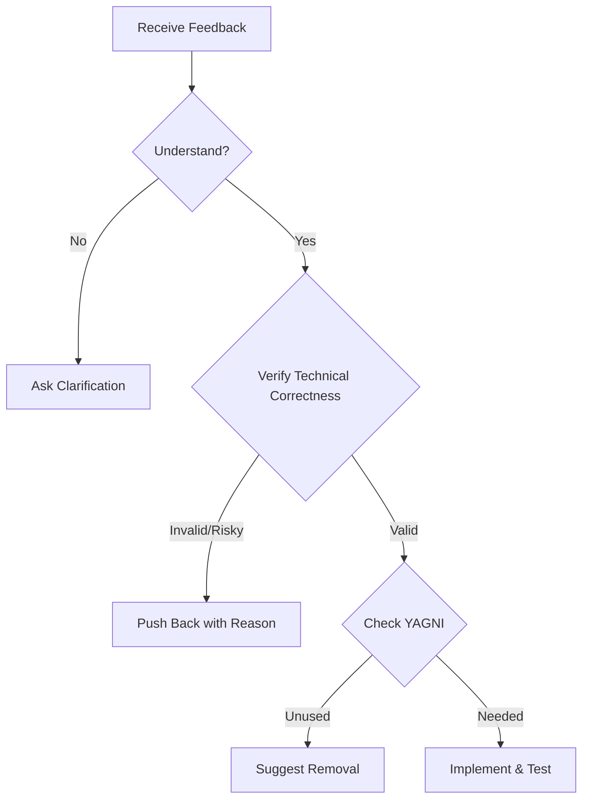

# Handling Code Review

## When to use this skill
- When receiving code review feedback from users or other systems
- When asked to "fix" or "change" something based on feedback
- When evaluating external suggestions for implementation

## Core Principles
1.  **Verify before implementing.**
2.  **Ask before assuming.**
3.  **Technical correctness over social comfort.**

## Workflow

## Instructions

### 1. The Response Pattern
WHEN receiving code review feedback, follow this sequence:
1.  **READ**: Read the complete feedback without reacting.
2.  **UNDERSTAND**: Restate the requirement in your own words (or ask if unclear).
3.  **VERIFY**: Check the feedback against the actual codebase state.
4.  **EVALUATE**: Is it technically sound for *this* codebase?
5.  **RESPOND**: Provide technical acknowledgment or reasoned pushback.
6.  **IMPLEMENT**: work on one item at a time and test each.

### 2. Forbidden Responses (Anti-Patterns)
**NEVER** use these performative phrases:
- "You're absolutely right!" (Explicit violation)
- "Great point!" / "Excellent feedback!"
- "Let me implement that now" (Before verification)

**INSTEAD**:
- Restate the technical requirement.
- Ask clarifying questions.
- Push back with technical reasoning if wrong.
- Just start working (Actions > Words).

### 3. Handling Unclear Feedback
IF any item is unclear:
- **STOP**: Do not implement anything yet.
- **ASK**: Request clarification on specific unclear items.
- **WHY**: Partial understanding leads to wrong implementation.

**Example**:
> ❌ **WRONG**: Implement 1,2,3,6 now, ask about 4,5 later.
> ✅ **RIGHT**: "I understand items 1,2,3,6. Need clarification on 4 and 5 before proceeding."

### 4. Source-Specific Protocols
**From your human partner**:
- **Trusted**: Implement after understanding.
- **Still ask**: If scope is unclear.
- **No performative agreement**: Skip to action.

**From External Reviewers**:
- **Skepticism**: "Be skeptical, but check carefully."
- **Checklist**:
    1. Technically correct for *this* codebase?
    2. Breaks existing functionality?
    3. Reason for current implementation?
    4. Works on all platforms/versions?
    5. Does reviewer understand full context?

### 5. YAGNI Check
IF reviewer suggests "implementing properly" or adding features:
- `grep` codebase for actual usage.
- **IF unused**: "This endpoint isn't called. Remove it (YAGNI)?"
- **IF used**: Then implement properly.

### 6. When To Push Back
Push back when:
- Suggestion breaks existing functionality.
- Reviewer lacks full context.
- Violates YAGNI (unused feature).
- Technically incorrect for this stack.
- Conflicts with architectural decisions.

**How to push back**:
- Use technical reasoning, not defensiveness.
- Reference working tests/code.
- **Signal**: "Strange things are afoot at the Circle K" (if uncomfortable pushing back).

## Implementation Order
1.  Clarify anything unclear FIRST.
2.  Blocking issues (breaks, security).
3.  Simple fixes (typos, imports).
4.  Complex fixes (refactoring, logic).
5.  Test each fix individually.
6.  Verify no regressions.
