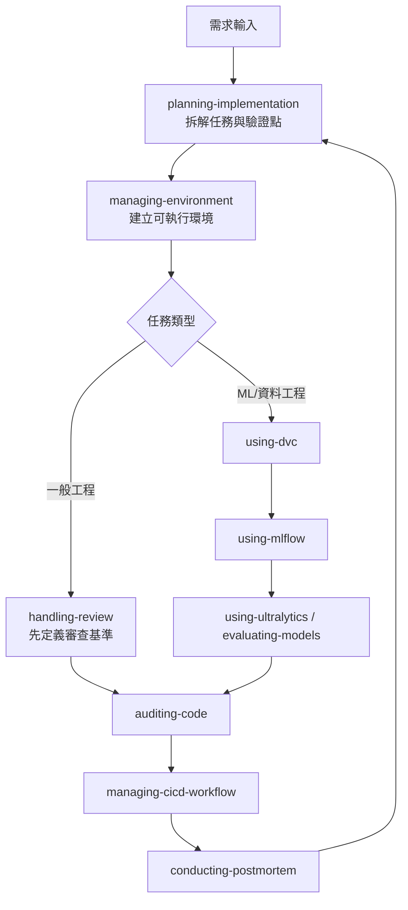
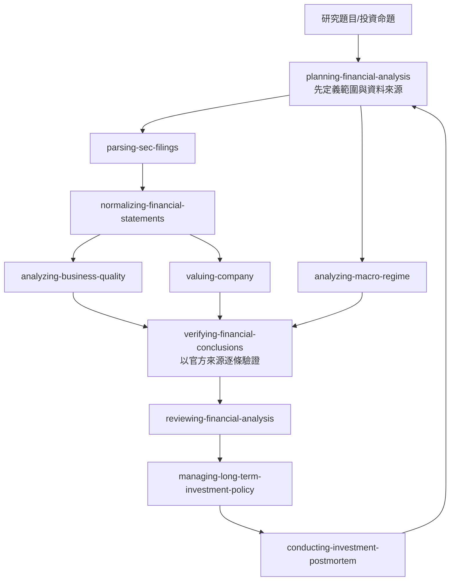
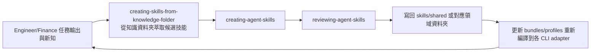

# Antigravity Skills Pack

本目錄是跨專案共用的**全域技能庫**，提供「任務路由 + 實作守門 + 領域最佳實踐」三層能力，協助 AI 代理在多步驟工程任務中維持一致性與可追蹤性。

## 1) 雙層架構

```text
your-project/
├─ skills/                             ← 專案層（Project-Local）：只放該專案差異覆寫
│  └─ cicd-skills/
│     └─ SKILL.md                      ← 覆寫 global 同名 skill（優先載入）
├─ my-agent-skills/                    ← 全域層（Global）
│  ├─ skills/
│  │  ├─ shared/                       ← 跨 agent 共用技能
│  │  ├─ engineer/                     ← 工程領域技能
│  │  ├─ finance/                      ← 金融領域技能
│  │  └─ meta/                         ← 技能開發/審核類技能
│  ├─ bundles/
│  ├─ policies/
│  ├─ profiles/
│  └─ global-rules.md
├─ AGENTS.md
└─ skill_scheduler.py
```

### 優先順序規則
- `skill_scheduler.py` 先掃 `./skills/`，再掃 `./my-agent-skills/`。
- **同名 identifier 去重**：第一個被掃到的贏（= project-local 覆寫 global）。
- 若 `./skills/` 不存在或為空，所有技能自動 fallback 到 global 層。

### 何時使用哪一層？

| 內容類型 | 放置位置 | 範例 |
|---|---|---|
| 跨專案通用流程 | `./my-agent-skills/skills/` | shared/engineer/finance/meta 分層技能 |
| 專案特定參數/覆寫 | `./skills/` | IP whitelist、job 名稱、硬體對照表 |
| 專案獨有且不通用的 skill | `./skills/` | 專案私有部署腳本、內部 API 整合 |

### 撰寫 Project Override 的原則
1. **只寫差異**：繼承 global 的流程，只覆寫專案特定細節（IP、環境、job 名稱）。
2. **保持同名**：`name` frontmatter 必須與 global skill 的 identifier 一致，scheduler 才能正確去重。
3. **交叉引用**：在 override 中註明「通用流程請參考 global skill」，避免內容重複維護。

## 2) Global Skill Inventory（含潛在風險）

| Skill | 主要職責 | 潛在風險 | 風險控制建議 |
|---|---|---|---|
| [brainstorming-product-design](skills/engineer/brainstorming/skill.md) | 需求探索與產品構想釐清 | 需求尚未收斂就進入實作，造成返工 | 先輸出可驗證需求，再交由 planning 拆解 |
| [planning-implementation](skills/engineer/planning/skill.md) | 產出可執行的實作步驟 | 過度規劃或步驟粒度不一致，影響執行效率 | 強制原子化步驟，並在每階段加入驗證點 |
| [managing-environment](skills/engineer/managing-environment/SKILL.md) | 依賴安裝、環境初始化、容器化決策 | Docker-first 在非容器場景可能增加啟動成本 | 先檢查專案現況，保留 venv/conda 合理落地分支 |
| [handling-review](skills/engineer/handling-review/SKILL.md) | 審查意見技術化評估與執行 | 過度保守造成變更吞吐下降 | 區分阻斷性問題與一般建議，採分層處理 |
| [auditing-code](skills/engineer/auditing-code/SKILL.md) | 靜態分析、資安檢查、反模式偵測 | 誤報造成噪音，影響決策速度 | 將檢查結果分級（Critical/High/Info）並附可重現證據 |
| [managing-cicd-workflow](skills/engineer/cicd-skills/SKILL.md) | 通用 trunk-based CI/CD 流程 | 過度通用導致專案細節遺漏 | 搭配 `./skills/` project override 補充專案參數 |
| [evaluating-models](skills/engineer/evaluating-models/SKILL.md) | 模型評估、指標比較、結果解讀 | 指標導向偏誤，忽略資料品質與成本約束 | 評估結論必須同時附資料假設與使用情境 |
| [using-ultralytics](skills/engineer/using-ultralytics/SKILL.md) | YOLO 系列訓練/推論/部署指引 | 版本更新快，文件易過期 | 引用前標註版本，必要時回查官方文件 |
| [using-mlflow](skills/engineer/using-mlflow/SKILL.md) | MLflow Tracking/Registry 實作指引 | 實驗命名與追蹤規範不一致，導致可追溯性下降 | 先統一命名規範與 artifact policy 再執行 |
| [using-dvc](skills/engineer/using-dvc/SKILL.md) | 資料與模型版本治理 | `dvc commit` / `git commit` 不同步造成狀態漂移 | 在流程中加入同步檢查與 pre-commit 驗證 |
| [creating-agent-skills](skills/meta/gemini-skill-creator/skill.md) | 生成新技能框架與模板 | 快速生成可能複製舊規範缺陷 | 產出後必須經 reviewer skill 審核 |
| [reviewing-agent-skills](skills/meta/gemini-skill-reviewer/SKILL.md) | 技能品質審計與紅隊檢查 | 審計規則若過嚴會抑制迭代速度 | 以風險優先級定義必過/可延後項目 |
| [creating-skills-from-knowledge-folder](skills/shared/creating-skills-from-knowledge-folder/SKILL.md) | 從指定知識資料夾批次生成技能 | 知識來源噪音或衝突導致 skill 品質下降 | 強制先做資料盤點、再經 creator/reviewer 雙步流程 |
| [conducting-postmortem](skills/engineer/conducting-postmortem/SKILL.md) | 事故回饋與技能持續改進 | 事故樣本偏差造成錯誤優化方向 | 要求跨事件比對，避免單一案例過擬合 |
| [parsing-sec-filings](skills/finance/parsing-sec-filings/SKILL.md) | 擷取 10-K/10-Q/8-K 結構化重點 | 引用錯誤期別或錯誤發行人 | 強制附上 form/date/accession 與章節引用 |
| [normalizing-financial-statements](skills/finance/normalizing-financial-statements/SKILL.md) | 財報欄位標準化與可比化 | 單位與會計口徑不一致導致誤判 | 強制單位檢查、期間對齊、缺值標記 |
| [analyzing-business-quality](skills/finance/analyzing-business-quality/SKILL.md) | 企業品質與護城河評估 | 敘事偏誤壓過財務事實 | 強制 bull/bear 雙面證據與信心分級 |
| [valuing-company](skills/finance/valuing-company/SKILL.md) | DCF + 可比法估值與敏感度分析 | 單點估值過度自信 | 強制 bear/base/bull、敏感度與安全邊際 |
| [analyzing-macro-regime](skills/finance/analyzing-macro-regime/SKILL.md) | 總體環境判讀與資產影響映射 | 使用過期數據或過度敘事 | 強制標註資料日期、替代情境與失效觸發 |
| [managing-long-term-investment-policy](skills/finance/managing-long-term-investment-policy/SKILL.md) | 長期投資紀律與政策框架 | 短期情緒驅動決策偏離策略 | 強制定義再平衡、風險預算與違規處置規則 |
| [verifying-financial-conclusions](skills/finance/verifying-financial-conclusions/SKILL.md) | 用官方網站與法規來源驗證分析結論 | 依賴次級來源造成誤判 | 強制 primary source 優先與逐條 claim 驗證 |
| [planning-financial-analysis](skills/finance/planning-financial-analysis/SKILL.md) | 金融研究任務拆解與分析規劃 | 未定義範圍就直接下結論 | 先鎖定目標/範圍/資料來源再執行 |
| [reviewing-financial-analysis](skills/finance/reviewing-financial-analysis/SKILL.md) | 金融分析審核與偏誤檢查 | 無證據結論或隱藏假設 | findings-first 審核與嚴格證據追溯 |
| [conducting-investment-postmortem](skills/finance/conducting-investment-postmortem/SKILL.md) | 投資決策事後檢討與流程升級 | 只看報酬不看決策品質 | 區分流程錯誤與結果波動，輸出具體規則更新 |

## 3) 路由與治理建議

1. **先跑 scheduler，再執行技能**：避免憑直覺選錯技能。
2. **預設採「Plan → Domain → Review」順序**：降低漏檢與回滾成本。
3. **對高風險任務（部署、資料、相依）保留人工確認點**。
4. 若出現 guardrail 警告，優先處理「候選篩選噪音」而非盲目提高 read limit。
5. **專案特化需求一律走 `./skills/` override**，不要修改本目錄內的 global skill。

## 4) 維運建議（給技能維護者）

- 每次新增/修改 skill，至少更新：
  - 對應 frontmatter（`name`, `description`）
  - 觸發條件（When to use this skill）
  - 風險與限制（至少 1 條）
- 建議定期檢查：
  - 路由名稱是否與檔名/identifier 一致
  - 是否存在專案綁定假設（IP、平台、路徑）未被明確標記
  - 全域規則與各 skill 規則是否衝突
- **Project override 維護**：
  - override 的 `name` 必須與 global skill 完全一致
  - override 不應複製 global 的流程內容，只寫差異
  - 當 global skill 變更時，檢查現有 override 是否仍相容

## 5) Canonical Bundle 與 Policy 規格

為了支援不同 CLI agent 套用不同 skill 組合包，本 repo 新增：

- `bundles/*.yaml`：角色技能包定義（例如 `engineer.yaml`, `finance.yaml`）
- `policies/base.yaml`：跨 bundle 共用治理規則（intent whitelist、retry、path contract）
- `profiles/*.yaml`：可直接套用的 agent profile 範本（給 bootstrap `--profile` 使用）

`agent-bootstrap` 會讀取上述 canonical 規格，編譯成各平台 adapter prompt/config 產物，避免手動維護多份規則。

可直接使用的 profile 範本：
- `profiles/engineer-codex.yaml`
- `profiles/finance-multi-agent.yaml`

## 6) Mermaid：Engineer / Finance Skills 協作流程

這一節用流程圖說明兩個 agent 在各自 bundle 內，技能如何分工與互相回饋。

### Engineer Agent 技能協作



| 節點 | 何時觸發 | 主要輸入 | 主要輸出 | 下一步 |
|---|---|---|---|---|
| `planning-implementation` | 收到新需求、需求變更、返工重排時 | 需求描述、限制條件、成功定義 | 任務分解清單、驗證點、風險清單 | `managing-environment` |
| `managing-environment` | 需要建立或修復執行環境時 | 語言版本、依賴列表、目標平台 | 可重現環境配置、安裝命令、環境驗證結果 | `handling-review` 或 ML 分支 |
| `handling-review` | 進入一般工程實作與 code review 前 | 實作差異、review 準則、風險優先級 | 審查結論、必要修改清單 | `auditing-code` |
| `using-dvc` | 涉及資料版本或資料產線時 | 資料來源、版本策略、pipeline 定義 | `dvc` stage/remote 設計、資料版本記錄 | `using-mlflow` |
| `using-mlflow` | 需要追蹤實驗與模型登錄時 | 實驗參數、評估指標、artifact 規範 | run 記錄、模型版本、追溯 metadata | `using-ultralytics` / `evaluating-models` |
| `using-ultralytics` / `evaluating-models` | 進行模型訓練、推論、評估時 | 資料切分、模型設定、基準指標 | 指標報告、誤差分析、部署候選模型 | `auditing-code` |
| `auditing-code` | 進入合併前 gate 或高風險改動後 | 程式差異、掃描規則、安全基線 | 缺陷分級報告（Critical/High/Info） | `managing-cicd-workflow` |
| `managing-cicd-workflow` | 準備交付、發版、自動化驗證時 | build/test/deploy 規則、分支策略 | CI/CD pipeline 變更、部署檢查清單 | `conducting-postmortem` |
| `conducting-postmortem` | 事故、退版、重大偏差發生後 | 事件時間線、指標變化、決策紀錄 | 根因分析、流程修正項、skill 優化候選 | 回到 `planning-implementation` |

### Finance Agent 技能協作



| 節點 | 何時觸發 | 主要輸入 | 主要輸出 | 下一步 |
|---|---|---|---|---|
| `planning-financial-analysis` | 新研究題目、投資假設更新時 | 研究目標、期間、標的清單、資料來源 | 分析範圍、問題清單、資料抓取計畫 | `parsing-sec-filings` / `analyzing-macro-regime` |
| `parsing-sec-filings` | 需要萃取 10-K/10-Q/8-K 事實時 | 公司識別、form type、報告期間 | 結構化 filing 摘要（含 form/date/accession） | `normalizing-financial-statements` |
| `normalizing-financial-statements` | 多來源財務數據需可比化時 | 財報欄位、單位、期間、會計口徑 | 標準化報表、缺值與調整標記 | `analyzing-business-quality` / `valuing-company` |
| `analyzing-business-quality` | 需要評估護城河與經營品質時 | 營運指標、競爭資訊、管理層訊號 | bull/bear 證據清單、品質評級、信心分級 | `verifying-financial-conclusions` |
| `valuing-company` | 需要估值區間與安全邊際時 | 標準化財報、假設參數、同業資料 | bear/base/bull 估值區間、敏感度結果 | `verifying-financial-conclusions` |
| `analyzing-macro-regime` | 需要判讀總體環境對資產影響時 | 通膨/利率/就業等數據、政策訊號 | 情境地圖、失效條件、資產影響矩陣 | `verifying-financial-conclusions` |
| `verifying-financial-conclusions` | 形成結論前做事實驗證時 | 待驗證 claim、來源清單 | claim-by-claim 驗證結果（primary source 優先） | `reviewing-financial-analysis` |
| `reviewing-financial-analysis` | 交付報告前最終審核時 | 全部分析輸出、假設、引用證據 | findings-first 審核報告、缺口與修正建議 | `managing-long-term-investment-policy` |
| `managing-long-term-investment-policy` | 需形成可執行長期策略時 | 風險承受度、投資期限、資產配置原則 | 投資政策書、再平衡規則、風險預算 | `conducting-investment-postmortem` |
| `conducting-investment-postmortem` | 交易/決策週期結束或偏差超標時 | 決策前假設、實際結果、偏差資料 | 流程修正、規則更新、下輪研究要求 | 回到 `planning-financial-analysis` |

### 跨 Agent 共用技能回饋閉環



| 節點 | 何時觸發 | 主要輸入 | 主要輸出 | 下一步 |
|---|---|---|---|---|
| `creating-skills-from-knowledge-folder` | 有新知識庫、SOP、案例可轉 skill 時 | 指定知識資料夾、目標 agent 類型 | 候選 skill 需求清單、來源對照 | `creating-agent-skills` |
| `creating-agent-skills` | 需要把候選需求轉成 skill 草稿時 | 候選清單、技能模板、規範要求 | `SKILL.md` 草稿、觸發條件、輸入/輸出契約 | `reviewing-agent-skills` |
| `reviewing-agent-skills` | skill 上線前品質審核時 | skill 草稿、紅隊檢核點 | 缺陷清單、修訂建議、可上線判定 | 寫回對應資料夾 |
| 寫回分層目錄 | 通過審核後發布時 | 最終 skill 內容、分類決策 | 更新 `skills/shared|engineer|finance|meta/` | 更新 bundle/profile |
| 更新 `bundles/profiles` 並編譯 adapter | 新 skill 要被特定 agent 使用時 | bundle/profile 設定、policy | 各 CLI 可用的 prompt/config 產物 | 回到 Engineer/Finance 任務執行 |

