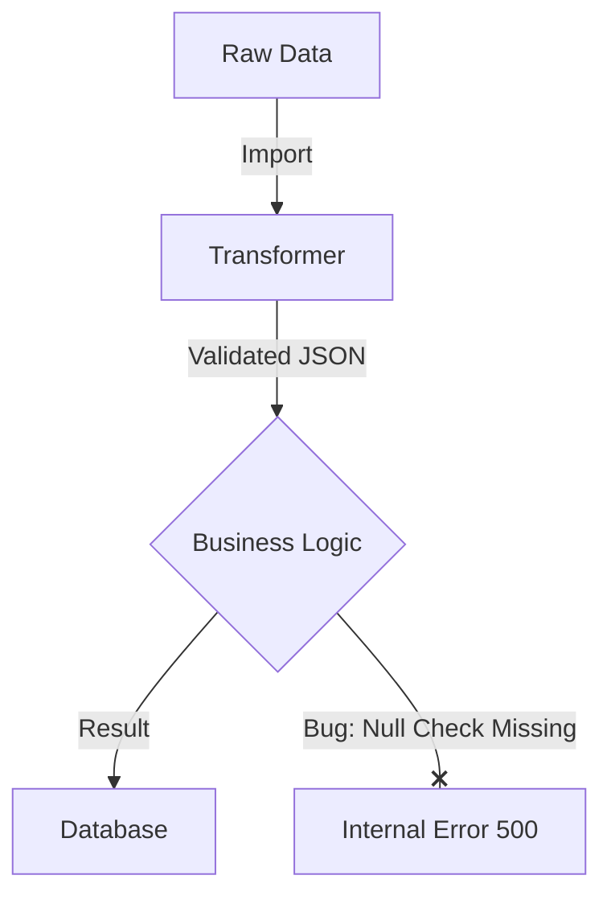
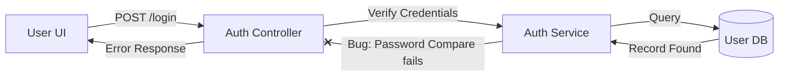
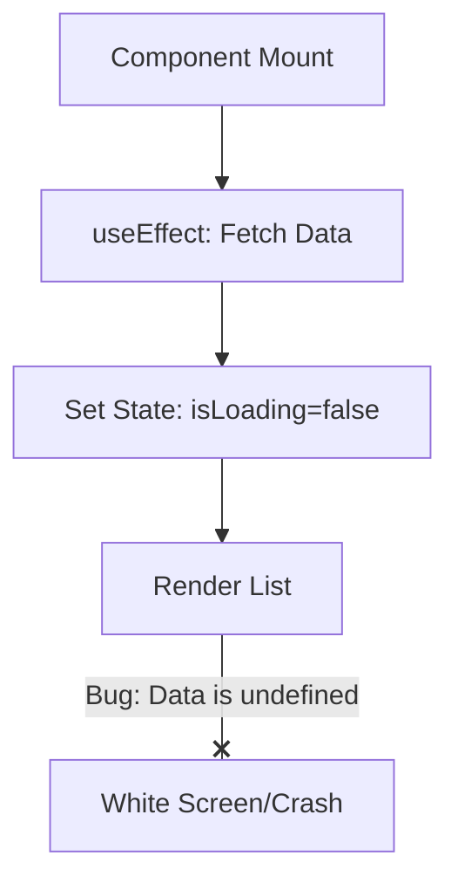

# Debugging Diagram Templates (Mermaid)

Use these templates in `DEBUG_CONTEXT.md` to visualize system flow and failure location.

## 1. Data Pipeline Template
When to use: data ingestion, transformation, and persistence failures.


## 2. API Request/Response Template
When to use: endpoint logic or contract mismatch issues.


## 3. UI Lifecycle Template
When to use: rendering, state update, and client-side crash issues.


## 4. State Machine Template
When to use: race conditions, retries, and async transition bugs.
```mermaid
stateDiagram-v2
  [*] --> IDLE
  IDLE --> PROCESSING: onClick
  PROCESSING --> SUCCESS: Complete
  PROCESSING --> FAILED: Error
  PROCESSING --> IDLE: Reset
  note right of PROCESSING : Bug: Race Condition here
```

## 5. Usage Rule
- Keep diagrams minimal and only include nodes relevant to current failure.
- Mark the suspected failure edge with `--x`.
- Update the diagram after root cause is confirmed.
