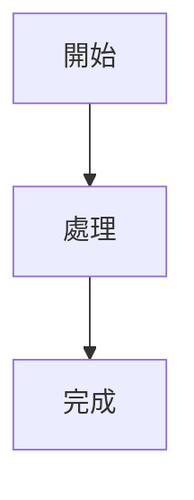

# 文件模板

以下模板用於快速產出中文技術文件骨架。請依文件主類型選一份使用，不要混搭成大雜燴。

## 共用開頭模板

```md
# 文件標題

## 文件摘要
- 文件類型：
- 目標讀者：
- 文件目標：
- 非目標：
- 前置條件：

## 快速導覽
- 這份文件適合誰
- 這份文件能解決什麼問題
- 不包含哪些內容
```

## Tutorial 模板

```md
# <教學標題>

## 你將完成什麼

## 適用對象

## 前置條件

## Step 1. <第一步>

## Step 2. <第二步>

## Step 3. <第三步>

## 驗證結果

## 常見問題

## 下一步
```

使用提示：

- 每一步都應該有可觀察結果
- 優先讓讀者在最短路徑內完成第一個成功案例
- 不要在每一步中插入太多理論

## How-to 模板

```md
# <任務標題>

## 目的

## 前置條件

## 操作步驟

### 1. <步驟一>

### 2. <步驟二>

### 3. <步驟三>

## 驗證方式

## 錯誤排查

## 相關文件
```

使用提示：

- 以完成任務為唯一目標
- 只保留必要背景
- 如需原理解釋，改放到 Explanation 文件並附連結

## Explanation 模板

```md
# <概念或架構主題>

## 背景

## 問題定義

## 核心概念

## 架構或流程

## 設計取捨

## 替代方案

## 限制與風險

## 相關任務文件
```

使用提示：

- 重點是 why，不是 step-by-step
- 優先加入架構圖、流程圖、範例情境
- 若內容太長，將詳細規格拆到 Reference

## Reference 模板

```md
# <參考文件標題>

## 概覽

## 欄位 / 指令 / API 一覽

| 名稱 | 說明 | 型別 | 必填 | 預設值 | 備註 |
| --- | --- | --- | --- | --- | --- |

## 詳細說明

## 範例

## 限制

## 相關文件
```

使用提示：

- 優先使用表格
- 每個欄位說明格式要一致
- 避免長篇敘事

## 補充區塊模板

可依需要加入下列區塊：

```md
## 注意事項

## 已知限制

## Gotchas

## Mermaid 圖


```

```md
## 範例指令

```bash
<command>
```
```

```md
## 範例程式碼

```ts
// example
```
```

## 模板選用規則

- 新手入門選 `Tutorial`
- 單一任務選 `How-to`
- 架構與原因選 `Explanation`
- 精確規格查詢選 `Reference`
- 同一份文件若同時需要兩種以上模板，應優先考慮拆檔
