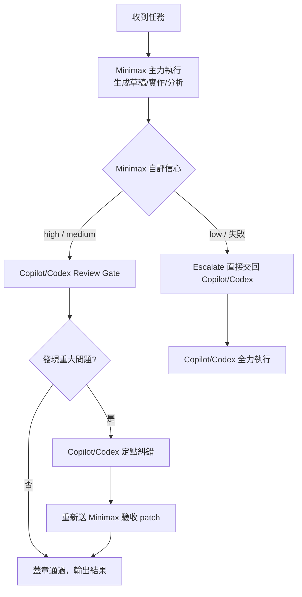

# Skill: using-minimax

## 核心理念

```
Minimax（主力）→ 輸出草稿/實作  →  Copilot/Codex（Review Gate）→ 審查+糾錯
```

> Copilot / Codex 的角色是**高信號守門員**，而非全程主導者。
> 凡是 Minimax 可獨立完成且結果可驗證的任務，均交給 Minimax。
> 高階模型只在以下情況介入：發現重大偏差、風險決策、最終品質蓋章。

---

## When to Use This Skill

**任何任務**在送給 Copilot/Codex 之前，先問：

> *「Minimax 能不能完成 80% 以上？」*

若是 → 啟動此 skill，走 Draft-Review 流程。

---

## 角色分工

| 層 | 執行者 | 職責 | Token 比重 |
|---|---|---|---|
| **主力層（Draft）** | Minimax | 實作、分析、草稿、摘要、翻譯、格式轉換、程式碼初稿、文件撰寫、資料清洗邏輯、測試案例草稿 | ~85% |
| **Review Gate** | Copilot / Codex | 審查正確性、標記風險、執行糾錯、最終品質蓋章 | ~15% |

### Copilot/Codex 介入門檻（需滿足其中一條）

- Minimax 輸出含**邏輯錯誤、安全漏洞、金融計算偏差**
- 任務涉及**不可逆操作**（刪除、部署、資金移動）
- Minimax 輸出信心分級 < `medium`（自評）
- 人工或 CI 標記需要 escalate

---

## 環境設定

```bash
# 加入 ~/.bashrc / ~/.zshrc 或專案 .env
export MINIMAX_API_KEY="your_minimax_api_key_here"
export MINIMAX_BASE_URL="https://api.minimax.io/v1"  # 國際版；中國版改 minimaxi.chat
```

> ⚠️ 絕不 hardcode API key；絕不將含 PII / 機密程式碼的 payload 送至外部 API。

---

## 執行流程



---

## API 呼叫規範

### Shell（curl）

```bash
# 1. Minimax 主力執行
RESULT=$(curl -s "${MINIMAX_BASE_URL}/text/chatcompletion_v2" \
  -H "Authorization: Bearer ${MINIMAX_API_KEY}" \
  -H "Content-Type: application/json" \
  -d "{
    \"model\": \"MiniMax-M2.7\",
    \"messages\": [
      {\"role\": \"system\", \"content\": \"你是資深工程師，請完成以下任務並在最後以 JSON 輸出 {\\\"confidence\\\": \\\"high|medium|low\\\", \\\"risks\\\": [...]}\"},
      {\"role\": \"user\", \"content\": \"${TASK_CONTENT}\"}
    ],
    \"temperature\": 0.2,
    \"max_tokens\": 4096
  }")

echo "$RESULT"
# 2. 解析信心等級決定是否需要 Review Gate
CONFIDENCE=$(echo "$RESULT" | python3 -c "import sys,json,re; d=json.load(sys.stdin); c=json.loads(sys.stdin.read() if False else re.search(r'\{.*\}',d['choices'][0]['message']['content'],re.S).group()); print(c['confidence'])" 2>/dev/null || echo "medium")
```

### Python（推薦）

```python
import os, re, json
import httpx

MINIMAX_API_KEY = os.environ["MINIMAX_API_KEY"]
MINIMAX_BASE_URL = os.environ.get("MINIMAX_BASE_URL", "https://api.minimax.io/v1")

DRAFT_SYSTEM = """你是資深工程師／分析師，負責完成任務主體。
完成後，在回應最末附上一個 JSON 區塊（獨立一行）：
{"confidence": "high|medium|low", "risks": ["..."], "review_points": ["需要 reviewer 特別注意的點"]}"""

REVIEW_SYSTEM = """你是嚴格的 Review Gate。你的工作是：
1. 找出草稿中的邏輯錯誤、安全漏洞、不一致之處。
2. 若問題輕微 → 直接修正並標記 [PATCHED]。
3. 若問題嚴重 → 標記 [ESCALATE] 並說明原因。
4. 若草稿正確 → 回覆 [APPROVED] + 一句摘要。
絕不對正確的草稿進行不必要的改寫。"""

def minimax_draft(task: str) -> dict:
    """讓 Minimax 主力執行任務，回傳草稿與信心評估。"""
    r = httpx.post(
        f"{MINIMAX_BASE_URL}/text/chatcompletion_v2",
        headers={"Authorization": f"Bearer {MINIMAX_API_KEY}"},
        json={
            "model": "MiniMax-M2.7",
            "messages": [
                {"role": "system", "content": DRAFT_SYSTEM},
                {"role": "user", "content": task},
            ],
            "temperature": 0.2,
            "max_tokens": 4096,
        },
        timeout=60,
    )
    r.raise_for_status()
    content = r.json()["choices"][0]["message"]["content"]
    # 解析末尾 JSON
    meta = {}
    m = re.search(r'\{[^{}]*"confidence"[^{}]*\}', content, re.S)
    if m:
        try:
            meta = json.loads(m.group())
            content = content[: m.start()].strip()
        except json.JSONDecodeError:
            pass
    return {"draft": content, "confidence": meta.get("confidence", "medium"),
            "risks": meta.get("risks", []), "review_points": meta.get("review_points", [])}


def copilot_review(draft: str, review_points: list[str]) -> str:
    """
    此函式由 Copilot/Codex agent 本身執行（非 API 呼叫）。
    傳入 Minimax 草稿，由高階模型審查並輸出 [APPROVED] / [PATCHED] / [ESCALATE]。
    實際整合時，將此函式的 prompt 插入 Copilot/Codex 的下一輪 user message。
    """
    points_str = "\n".join(f"- {p}" for p in review_points) or "（無特別標記）"
    return (
        f"<MINIMAX_DRAFT>\n{draft}\n</MINIMAX_DRAFT>\n\n"
        f"Minimax 標記的 review points：\n{points_str}\n\n"
        "請依 Review Gate 規則審查並輸出結論。"
    )
```

---

## 模型選擇

| 模型 | 建議場景 |
|---|---|
| `MiniMax-M2.7` | 程式碼初稿、長文分析、複雜結構化任務（預設） |
| `MiniMax-M2.7-highspeed` | 速度優先的輕量任務（摘要、翻譯、格式轉換） |
| `MiniMax-M2.5` | 中等複雜度任務，平衡速度與品質 |
| `MiniMax-M2.5-highspeed` | 快速摘要、簡單 Q&A |

> Token Plan 支援 M 系列（M2.7 / M2.5 / M2.1）；舊版 Text-01 / abab 系列不適用。

---

## 輸入 / 輸出契約

**輸入**：
- `task`：完整任務描述（同原本要給 Copilot/Codex 的 prompt）
- `context`（可選）：相關 code、文件片段（不含機密）
- `max_tokens`（可選）：預設 4096

**輸出**：
- `draft`：Minimax 產出的主體內容
- `confidence`：`high | medium | low`
- `risks`：Minimax 自評風險清單
- `review_points`：需要 Review Gate 特別注意的點
- `review_verdict`：Review Gate 結論（`APPROVED` / `PATCHED` / `ESCALATE`）

---

## 風險與限制

| 風險 | 控制措施 |
|---|---|
| Minimax 輸出靜默錯誤 | 強制自評 confidence；低信心強制 escalate |
| Review Gate 過度介入 | 僅針對 `review_points` 與明確錯誤審查；禁止無理由改寫通過的草稿 |
| 資料隱私 | 禁止傳送 PII、機密程式碼、未公開財務數據 |
| API 超時 / 不穩定 | 60s timeout；失敗自動 fallback 至 Copilot/Codex |
| Token 超支 | 每次呼叫設 `max_tokens` 上限；定期查 Minimax 用量儀表板 |

---

## Audit Log 格式

```
[using-minimax] 2026-05-07T08:17:54+08:00 | task=code-draft | model=MiniMax-M2.7 | confidence=high | verdict=APPROVED | minimax_tokens=1840 | copilot_tokens=120
```
